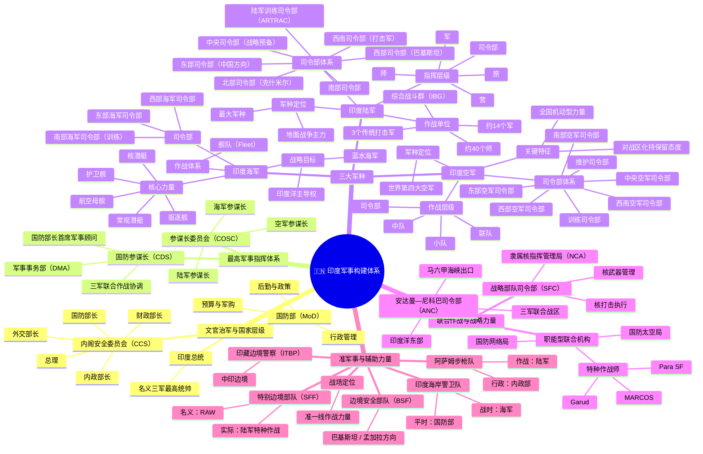

```mermaid
mindmap
  root((🇮🇳 印度军事构建体系))
    文官治军与国家层级
      印度总统
        名义三军最高统帅
      内阁安全委员会（CCS）
        总理
        国防部长
        内政部长
        外交部长
        财政部长
      国防部（MoD）
        行政管理
        预算与军购
        后勤与政策
    最高军事指挥体系
      国防参谋长（CDS）
        国防部长首席军事顾问
        三军联合作战协调
        军事事务部（DMA）
      参谋长委员会（COSC）
        陆军参谋长
        海军参谋长
        空军参谋长
    三大军种
      印度陆军
        军种定位
          最大军种
          地面战争主力
        指挥层级
          司令部
          军
          师
          旅
          营
        司令部体系
          北部司令部（克什米尔）
          西部司令部（巴基斯坦）
          西南司令部（打击军）
          南部司令部
          东部司令部（中国方向）
          中央司令部（战略预备）
          陆军训练司令部（ARTRAC）
        作战单位
          约14个军
          约40个师
          3个传统打击军
          综合战斗群（IBG）
      印度海军
        战略目标
          印度洋主导权
          蓝水海军
        作战体系
          舰队（Fleet）
        司令部
          西部海军司令部
          东部海军司令部
          南部海军司令部（训练）
        核心力量
          航空母舰
          驱逐舰
          护卫舰
          常规潜艇
          核潜艇
      印度空军
        军种定位
          世界第四大空军
        作战层级
          司令部
          联队
          中队
          小队
        司令部体系
          西部空军司令部
          东部空军司令部
          中央空军司令部
          西南空军司令部
          南部空军司令部
          维护司令部
          训练司令部
        关键特征
          全国机动型力量
          对战区化持保留态度
    联合作战与战略力量
      战略部队司令部（SFC）
        核武器管理
        核打击执行
        隶属核指挥管理局（NCA）
      安达曼—尼科巴司令部（ANC）
        三军联合战区
        马六甲海峡出口
        印度洋东部
      职能型联合机构
        国防网络局
        国防太空局
        特种作战师
          Para SF
          MARCOS
          Garud
    准军事与辅助力量
      印度海岸警卫队
        平时：国防部
        战时：海军
      阿萨姆步枪队
        行政：内政部
        作战：陆军
      特别边境部队（SFF）
        名义：RAW
        实际：陆军特种作战
      边境安全部队（BSF）
        巴基斯坦 / 孟加拉方向
      印藏边境警察（ITBP）
        中印边境
      战场定位
        准一线作战力量

```
